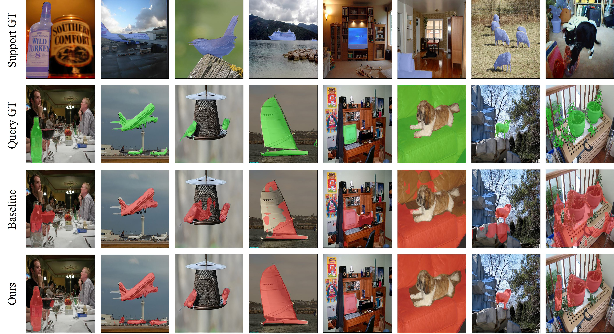

## Prototype-guided Salient Attention for Few-Shot Segmentation
This is the implementation of our paper [**Prototype-guided Salient Attention for Few-Shot Segmentation**](https://link.springer.com/article/10.1007/s00371-024-03582-1?utm_source=rct_congratemailt&utm_medium=email&utm_campaign=nonoa_20240801&utm_content=10.1007%2Fs00371-024-03582-1) that has been accepted to The Visual Computer. 


<p align="middle">
    
</p>

## Requirements

- Python 3.7
- PyTorch 1.5.1
- cuda 10.1
- tensorboard 1.14

## Datasets

- PASCAL-5<sup>i</sup>:  [VOC2012](http://host.robots.ox.ac.uk/pascal/VOC/voc2012/) + [SBD](http://home.bharathh.info/pubs/codes/SBD/download.html)

- COCO-20<sup>i</sup>:  [COCO2014](https://cocodataset.org/#download)

  Please see [OSLSM](https://arxiv.org/abs/1709.03410) and [FWB](https://openaccess.thecvf.com/content_ICCV_2019/html/Nguyen_Feature_Weighting_and_Boosting_for_Few-Shot_Segmentation_ICCV_2019_paper.html) for more details on datasets. 


## Test and Train
You only need to configure the relevant content in the relevant script file to run


### Training

> ```bash
> ./train.sh  
> ```

### Testing

> ```bash
> ./test.sh
> ```

## Visualization
<p align="middle">
    
</p>

## References

This repo is mainly built based on [BAM](https://github.com/chunbolang/BAM). Thanks for their great work!

# Citation

If you find this project useful, please consider citing:
```
@article{li2024psanet,
  title={Psanet: prototype-guided salient attention for few-shot segmentation},
  author={Li, Hao and Huang, Guoheng and Yuan, Xiaochen and Zheng, Zewen and Chen, Xuhang and Zhong, Guo and Pun, Chi-Man},
  journal={The Visual Computer},
  pages={1--15},
  year={2024},
  publisher={Springer}
}
```
