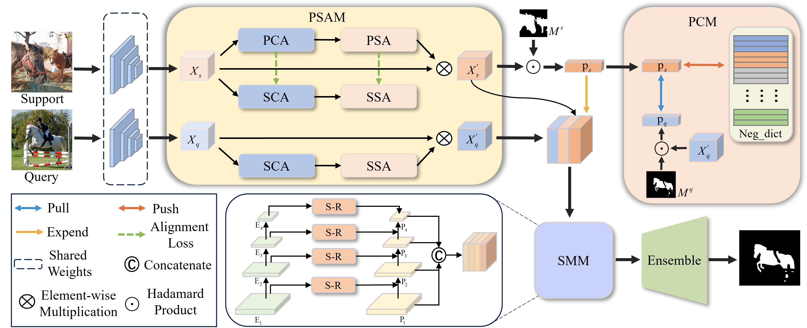

## Prototype-guided Salient Attention for Few-Shot Segmentation

    

## Requirements

- Python 3.7
- PyTorch 1.5.1
- cuda 10.1
- tensorboard 1.14

## Datasets

- PASCAL-5i:  [VOC2012](http://host.robots.ox.ac.uk/pascal/VOC/voc2012/) + [SBD](http://home.bharathh.info/pubs/codes/SBD/download.html)

- COCO-20i:  [COCO2014](https://cocodataset.org/#download)

  Please see [OSLSM](https://arxiv.org/abs/1709.03410) and [FWB](https://openaccess.thecvf.com/content_ICCV_2019/html/Nguyen_Feature_Weighting_and_Boosting_for_Few-Shot_Segmentation_ICCV_2019_paper.html) for more details on datasets. 